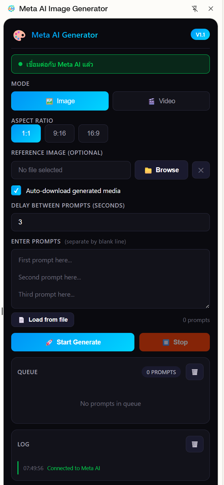

# 🎨 Meta AI Image Generator

**Meta AI Image Generator** เป็นเครื่องมือช่วยอำนวยความสะดวกในการสร้างสรรค์ผลงานรูปภาพและวิดีโอผ่าน Meta AI อย่างรวดเร็วและมีประสิทธิภาพ มาพร้อมกับระบบจัดการคิวคำสั่ง (Queue) และฟีเจอร์ปรับแต่งที่ครบครัน

*(กรุณาเปลี่ยนชื่อไฟล์รูปภาพตามไฟล์จริงในโปรเจกต์ของคุณ)*

## ✨ คุณสมบัติเด่น (Features)

- **Dual Mode:** รองรับทั้งการสร้าง **Image** และ **Video**
- **Custom Aspect Ratio:** เลือกสัดส่วนภาพได้ทั้ง `1:1`, `9:16` และ `16:9`
- **Bulk Generation:** รองรับการป้อน **Prompts** หลายรายการพร้อมกัน (แยกบรรทัด) หรือโหลดจากไฟล์
- **Queue System:** ระบบจัดการคิวงานอัจฉริยะ แสดงจำนวน Prompts ที่รอทำงาน
- **Auto-download:** ดาวน์โหลดไฟล์มีเดียที่สร้างเสร็จแล้วลงเครื่องทันที
- **Reference Image:** รองรับการอัปโหลดรูปภาพอ้างอิงเพื่อคุมสไตล์งาน
- **Real-time Logs:** หน้าต่าง Log แสดงสถานะการทำงานและการเชื่อมต่อ

## 🚀 การติดตั้ง (Installation)

1. ดาวน์โหลดหรือ Clone โปรเจกต์นี้ลงในเครื่องคอมพิวเตอร์
2. เปิด Google Chrome และไปที่ `chrome://extensions/`
3. เปิดใช้งาน **Developer mode** ที่มุมขวาบน
4. คลิกปุ่ม **Load unpacked**
5. เลือกโฟลเดอร์ของโปรเจกต์ที่ดาวน์โหลดมา

## 💡 วิธีใช้งาน (Usage)

1. ตรวจสอบสถานะสีเขียว **"Connected to Meta AI"**
2. เลือก **MODE** ที่ต้องการ (Image หรือ Video) และ **ASPECT RATIO**
3. (ตัวเลือกเสริม) อัปโหลด **Reference Image** โดยคลิก **Browse**
4. ป้อนคำสั่งในช่อง **ENTER PROMPTS** (หนึ่ง Prompt ต่อหนึ่งบรรทัด) หรือใช้ **Load from file**
5. ตั้งค่า **DELAY BETWEEN PROMPTS** เพื่อป้องกันการถูกจำกัดการใช้งาน
6. คลิก **Start Generate** เพื่อเริ่มทำงาน ระบบจะรันตามคิวใน **QUEUE**

## 📝 License

โปรเจกต์นี้เผยแพร่ภายใต้ MIT License
